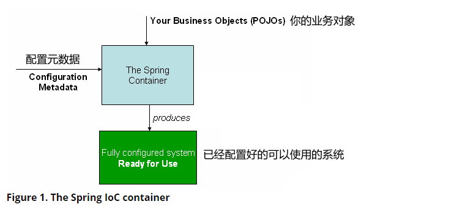

# 1. The IoC Container 

> `原文：`
>
> This chapter covers Spring’s Inversion of Control (IoC) container.
>
> `翻译：`
> 
> 本章介绍了Spring的控制反转容器(IoC)

## 1.1 Introduction to the Spring IoC Container and Beans (Spring IoC 容器 和 Bean简介)

> `原文：`
>
> This chapter covers the Spring Framework implementation of the Inversion of Control (IoC) principle. IoC is also known as dependency injection (DI). It is a process whereby objects define their dependencies (that is, the other objects they work with) only through constructor arguments, arguments to a factory method, or properties that are set on the object instance after it is constructed or returned from a factory method. The container then injects those dependencies when it creates the bean. This process is fundamentally the inverse (hence the name, Inversion of Control) of the bean itself controlling the instantiation or location of its dependencies by using direct construction of classes or a mechanism such as the Service Locator pattern.
>
> `翻译：`
> 
> 本章介绍了Spring Framework的控制反转(IoC)原则的实现。IoC也被称为依赖注入(DI)。在这个过程中，对象仅通过构造函数参数，工厂方法的参数，或者在对象实例被创建后或工厂方法返回后的属性值进行设置依赖项(即他们所需的对象)。然后容器在创建这些bean的时候注入依赖项。这个过程从根本上来说是Bean通过使用类的直接构造方法或者Service Locator模式等机制来控制其依赖项的实例化或位置的相反过程(因此被称作"控制反转")。

> `原文：`
>
> The org.springframework.beans and org.springframework.context packages are the basis for Spring Framework’s IoC container. The BeanFactory interface provides an advanced configuration mechanism capable of managing any type of object. ApplicationContext is a sub-interface of BeanFactory. It adds:
> 
> - Easier integration with Spring’s AOP features
> - Message resource handling (for use in internationalization)
> - Event publication
> - Application-layer specific contexts such as the WebApplicationContext for use in web applications.
>
> `翻译：`
>
> Spring Framework的IoC容器的基础包有 org.springframework.beans 和 org.springframework.context。BeanFactory接口为管理各种不同类型的对象提供了一些高级的配置机制。ApplicatonContext接口是BeanFactory的子接口，在BeanFactory接口的基础上，它还增加了如下功能:
>
> - 更容易于Spring的AOP特性进行集成
> - 消息资源处理(用于国际化)
> - 时间发布机制
> - 应用层特定的Context，例如WebApplicatonContext用于web应用程序

> `原文：`
> 
> In short, the BeanFactory provides the configuration framework and basic functionality, and the ApplicationContext adds more enterprise-specific functionality. The ApplicationContext is a complete superset of the BeanFactory and is used exclusively in this chapter in descriptions of Spring’s IoC container. For more information on using the BeanFactory instead of the ApplicationContext, see The BeanFactory.
>
> `翻译：`
> 
> 简而言之，BeanFactory接口提供了框架的配置能力和基本功能，ApplicationContext在BeanFactory的基础上增加了更多的特定于企业级别的功能。ApplicatoinContext接口是BeanFactory接口的完整超集，但只在本章所描述的Spring的IoC容器中用到。如果你想知道更多的使用BeanFactory接口的而不是ApplicationContext的信息，请参考[The BeanFactory](https://docs.spring.io/spring-framework/docs/5.3.8/reference/html/core.html#beans-beanfactory)

> `原文：`
>
> In Spring, the objects that form the backbone of your application and that are managed by the Spring IoC container are called beans. A bean is an object that is instantiated, assembled, and managed by a Spring IoC container. Otherwise, a bean is simply one of many objects in your application. Beans, and the dependencies among them, are reflected in the configuration metadata used by a container.
>
> `翻译：`
>
> 在Spring中，Bean是构成应用程序的主干部分，并且由Spring的IoC容器所管理。并且Bean是一个由Spring IoC容器实例化，装配，管理的对象。除以上特点之外，Bean仅仅是你应用程序中的许多普通对象之一。我们可以从Spring IoC容器使用的配置元数据信息中看到Bean以及Bean之间的依赖关系。

## 1.2. Container Overview

> `原文：`
>
> The org.springframework.context.ApplicationContext interface represents the Spring IoC container and is responsible for instantiating, configuring, and assembling the beans. The container gets its instructions on what objects to instantiate, configure, and assemble by reading configuration metadata. The configuration metadata is represented in XML, Java annotations, or Java code. It lets you express the objects that compose your application and the rich interdependencies between those objects.
>
> `翻译：`
>
> org.springframework.context.ApplicationContext接口代表了Spring的IoC容器，并且负责Bean的实例化，配置和组装(例如属性注入)。容器(IoC Container)通过读取配置元数据来知道如何实例化对象，如何对对象进行配置以及组装。我们可以通过XML配置文件，Java注解或者Java编程式构造等方式来构建配置元数据信息。这些配置元数据信息允许你表达组成你应用程序的对象，并且可以表达这些对象之间丰富的依赖关系。

> `原文：`
> 
> Several implementations of the ApplicationContext interface are supplied with Spring. In stand-alone applications, it is common to create an instance of ClassPathXmlApplicationContext or FileSystemXmlApplicationContext. While XML has been the traditional format for defining configuration metadata, you can instruct the container to use Java annotations or code as the metadata format by providing a small amount of XML configuration to declaratively enable support for these additional metadata formats.
>
> `翻译：`
>
> Spring提供了ApplicationContext接口的几个实现。在独立的应用程序中，创建ClassPathXmlApplication或者FileSystemXmlApplicationContext的实例是很常见的。虽然XML一直是定义配置元数据的传统格式，但是你可以通过一些少量的XML配置去让Spring支持Java注解或者编程式代码作为配置元数据的格式。

> `原文：`
>
> In most application scenarios, explicit user code is not required to instantiate one or more instances of a Spring IoC container. For example, in a web application scenario, a simple eight (or so) lines of boilerplate web descriptor XML in the file of the application typically suffices (see Convenient ApplicationContext Instantiation for Web Applications). If you use the Spring Tools for Eclipse (an Eclipse-powered development environment), you can easily create this boilerplate configuration with a few mouse clicks or keystrokes.web.xml
>
> `翻译：`
>
> 在大多数应用场景中，不需要使用明确的用户代码去实例化Spring IoC容器中的一个或多个实例。例如，在Web应用场景中，仅仅8行左右的XML描述代码通常就足够了(见Convenient ApplicationContext Instantiation for Web Applications)。如果你使用Spring Tools for Eclipse (一个由Eclipse驱动的开发环境)，你只需要点几下鼠标或者通过keystrokes.web.xml文件就可以创建这个模板配置。

> `原文：`
>
> The following diagram shows a high-level view of how Spring works. Your application classes are combined with configuration metadata so that, after the ApplicationContext is created and initialized, you have a fully configured and executable system or application.
>
> `翻译：`
> 
> 下图显示了Spring工作方式的高层视图。你的应用类与配置元数据相结合，这样，在ApplicationContext被创建和初始化之后，你就有了一个完全配置好的并且可以执行的系统或者应用程序。

### 1.2.1 Configuration Metadata

> `原文：`
>
> As the preceding diagram shows, the Spring IoC container consumes a form of configuration metadata. This configuration metadata represents how you, as an application developer, tell the Spring container to instantiate, configure, and assemble the objects in your application.
>
> `翻译：`
>
> 如上图所示，Spring IoC容器消费(即读取)一种配置元数据信息。这个配置元数据信息代表了作为应用开发者的你去告诉Spring IoC容器在你的应用中去如何实例化，配置和组装对象。

> `原文：`
>
> Configuration metadata is traditionally supplied in a simple and intuitive XML format, which is what most of this chapter uses to convey key concepts and features of the Spring IoC container.
>
> `翻译：`
>
> 配置元数据传统上是以简单直观的XML格式提供的，这也是为什么本文档中大多数章节都是采用XML格式来描述Spring IoC容器的概念和特性。

> `原文：`
>
> XML-based metadata is not the only allowed form of configuration metadata. The Spring IoC container itself is totally decoupled from the format in which this configuration metadata is actually written. These days, many developers choose Java-based configuration for their Spring applications.
>
> `翻译：`
>
> 基于XML的元数据并不是配置元数据的唯一表达形式。Spring IoC容器其本身是与这种配置元数据的实际编写格式是完全解耦的。如今，许多开发者为他们的Spring应用选择基于Java的配置(补充: 例如在Java类加上@Configuration注解)。

> `原文：`
>
>  For information about using other forms of metadata with the Spring container, see:
>
> `翻译：`
> 
> 在Spring容器中使用其他类型的元数据信息，请看：

> `原文：`
>
> - Annotation-based configuration: Spring 2.5 introduced support for annotation-based configuration metadata.
>
> `翻译: `
>
> - 基于注解的配置：Spring 2.5 引入了基于注解配置元数据的支持

> `原文：`
>
> - Java-based configuration: Starting with Spring 3.0, many features provided by the Spring JavaConfig project became part of the core Spring Framework. Thus, you can define beans external to your application classes by using Java rather than XML files. To use these new features, see the [@Configuration](https://docs.spring.io/spring-framework/docs/current/javadoc-api/org/springframework/context/annotation/Configuration.html), [@Bean](https://docs.spring.io/spring-framework/docs/current/javadoc-api/org/springframework/context/annotation/Bean.html), [@Import](https://docs.spring.io/spring-framework/docs/current/javadoc-api/org/springframework/context/annotation/Import.html), and [@DependsOn](https://docs.spring.io/spring-framework/docs/current/javadoc-api/org/springframework/context/annotation/DependsOn.html) annotations.
>
> `翻译：`
>
> - 基于Java的配置：从Spring 3.0开始，提供了许多特性的Spring JavaConfig成为了Spring Framework核心的一部分。因此，你可以通过Java类而不是XML文件来为你的应用定义外部的bean。为了使用这些新特性，请看@Configuration, @Bean, @Import和@DependsOn注解

